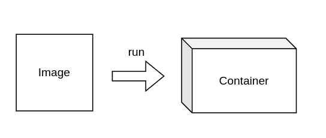

# Docker image

#docker #image #explained

- an immutable **snapshot of an environment**,
- a template for creating the environment (container) you wanted,
- an executable package that includes everything needed to run an application (so that’s the code, runtime, libraries, environment variables, and the configuration files)
- images are defined by **Dockerfile**
- **running instance** of an image it is a **container**

