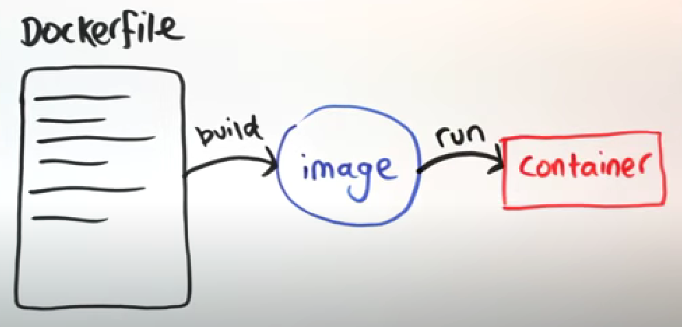

# Dockerfile

#dockerfile #intro #explained

- **“blueprint”** of Docker image
- Docker images are defined by Dockerfile,
- Dockerfile is a text file with instruction that **defines what goes on in the environment** inside your container, things like:
    - installation of a given software,
    - what files should be copied inside a container,
    - how do you access network resources,
    - what ports do you need to map to reach the outside world.

    
    

---
[Dockerfile templates](Dockerfile%20templates.md)