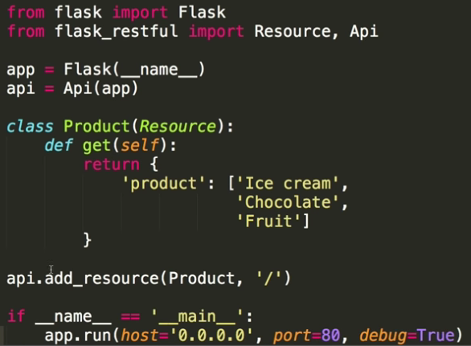

# Micro-services with Docker

`#docker` `#example` `#MicroService`

[Docker compose ](Docker%20compose.md)

**Source:** [https://www.youtube.com/watch?v=Qw9zlE3t8Ko](https://www.youtube.com/watch?v=Qw9zlE3t8Ko)

`api.py`

