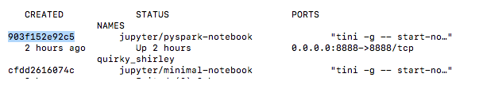

# Starting up container

#docker #start #container #run #interactive

## Starting up the Docker container

```bash
docker run --hostname=<host name> 
		   --ip <IPv4 i.e. 10.1.2.3>
		   --privileged=true 
		   --name <name of container>
		   -t 
		   -i  
		   -v <local working directory> 
		   [OPTIONS] 
		   [IMAGE] 
		   /usr/bin/docker-quickstart
```

## Common options

- `it` - runs Docker interactively (so you get a pseudo-TTY with STDIN)
	- `-i` is short for `--interactive`
	- `-t` set TTY to the docker container, it is as if you are inside the shell for the docker container. The stdout for the docker container is piped to your current shell and your input is piped to the docker container.


>`stdin, stdout, and ttys` are related concepts. `stdin` and `stdout`
 are the input and output streams of a process. A [pseudo terminal](http://en.wikipedia.org/wiki/Pseudo_terminal) (also known as a `TTY` or a `PTS`) connects a user's "terminal" with the `stdin` and `stdout` stream, commonly (but not necessarily) through a shell such as `bash`. I use quotes around "terminal" since we really don't use a terminal in the same sense today.  
> [https://stackoverflow.com/questions/22272401/what-does-it-mean-to-attach-a-tty-std-in-out-to-dockers-or-lxc](https://stackoverflow.com/questions/22272401/what-does-it-mean-to-attach-a-tty-std-in-out-to-dockers-or-lxc)


- `d` - runs the container in the **background**, so-called `detached mode` (Optional).

> When is on you don’t see the logs. You will find it by typing: **docker logs container-name** 

- `p <PORT>` - map any other ports (Optional)
- `v` - This makes it so notebooks we create are accessible in our folder on our local computer. It also allows us to make additional files such as data sources (e.g., CSV, Excel) accessible to our Jupyter notebooks. See: [Accessing data outside container](../Accessing%20data%20outside%20container.md)

## Common use case

```bash
docker run -itd <docker_image>
```

## Others options

- `-hostname` Optional: is a parameter which can be given along with `docker run` command which will set the specified name as containers hostname
- `-ip` Optional: is parameter to set specific ip address(ipv4) to that particular container.
- `-privileged=true` Required: for HBase, MySQL-backed Hive metastore, Hue, Oozie, Sentry, and ClouderaManager, and possibly others
- `i` Required: if you want to use the terminal, either immediately or attach later
- `t` Required: once services are started, a Bash shell takes over and will die without this
- `-rm` causes Docker to automatically remove the container when it exits.
- `-name` gives the container the name , which allows us to refer to the container by name instead of ID in the future.
- `e`defines key value pairs to set in the container’s environment when it starts up

Example with PySpark:

```bash
docker run -it 
			-p 8888:8888 
			-v "$(pwd):/home/jovyan/work" jupyter/pyspark-notebook  
			--name spark
```

The `-v $PWD:/home/jovyan/work` allows us to map our `spark-docker` folder (which should be our current directory - $PWD) to the container’s `/home/joyvan/work` working directory (i.e., the directory the Jupyter notebook will run from).

## Stopping container

#stop

```bash
docker stop <container name or id>
```

`docker container kill CONTAINER`to forcefully stop a running container

`docker container rm CONTAINER` to remove a container

## Starting up you docker container again:

Once you have started and exited out of your docker container the first time, you will start it differently for future uses since the container has already been run.

If you do not know the name of the container, you can easily find it with: `docker ps` or `docker container ls`.

Pass the following command to return all container names:

```bash
docker ps -a
```

Get the container id from the terminal:



Then run docker start with the container id to start the container:

```bash
docker start <container name or id i.e 903f152e92c5>
```

`docker container rm CONTAINER` to remove a container

`docker inspect CONTAINER` to view detailed information about a running container

---

[Accessing data outside container](../Accessing%20data%20outside%20container.md) | [Manage containers](Manage%20containers.md) 

# Source:

- http://maxmelnick.com/2016/06/04/spark-docker.html
- http://ondata.blog/articles/getting-started-apache-spark-pyspark-and-jupyter-in-a-docker-container/
- https://spin.atomicobject.com/2018/10/04/docker-command-line/
- [How to Use Docker Run Command with Examples (phoenixnap.com)](https://phoenixnap.com/kb/docker-run-command-with-examples) 

[https://stackoverflow.com/questions/36249744/interactive-shell-using-docker-compose](https://stackoverflow.com/questions/36249744/interactive-shell-using-docker-compose)